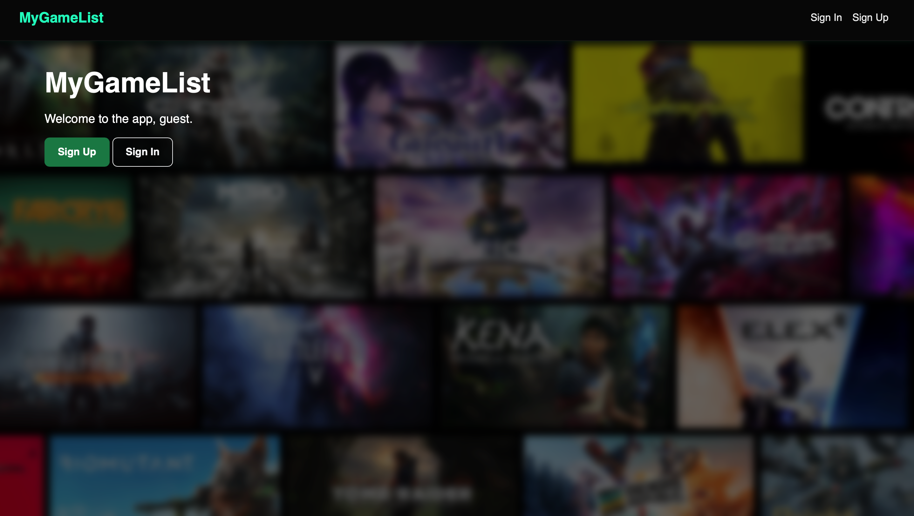

# 🎮 MyGameList

## 🕹️ Description

**MyGameList** is a simple and stylish game collection tracker where users can manage their video game library. Add your favorite games, mark your progress, upload cover images, and organize them by status like **Playing**, **Completed**, **Not Started**, and more!

Built with Node.js, Express, MongoDB, and EJS.

---

## 🚀 Getting Started

👉 Visit it here: [MyGameList Live Demo](https://my-game-list-ab9e59705c28.herokuapp.com)  
👉 Project Planning Materials:

- [User Stories](https://trello.com/b/r2GWO0n0/project-2)
- [Wireframes](https://trello.com/b/r2GWO0n0/project-2)
- [ERD (Entity Relationship Diagram)](https://trello.com/b/r2GWO0n0/project-2)

---

## 🎯 How It Works

- 📝 Sign up and log in to your personal account
- ➕ Add games with title, platform, status, and cover image
- 📂 Categorize games by status (Playing / Completed / Wishlist / Backlog)
- 🖼️ Upload images using Cloudinary
- ✏️ Edit or delete your games anytime
- 🔍 View your collection in alphabetical order
- 🌈 Enjoy a smooth, responsive design with flash messages and UI feedback

---

## 💡 Technologies Used

- Node.js + Express.js
- MongoDB + Mongoose
- EJS (Embedded JavaScript templates)
- Cloudinary (for image hosting)
- Multer (for file upload)
- Bootstrap (for layout and buttons)
- Express-session + connect-flash (for session & flash messaging)

---

## ⚙️ Features

- 🧑‍💻 User authentication system
- 🌐 Responsive game list layout
- 📸 Image upload & management
- 🆎 Sort games alphabetically by title
- 📁 Transparent navbar scroll effect on game detail page

---

## 📚 Attributions

- [Bootstrap for UI components](https://getbootstrap.com)
- [Cloudinary for image hosting](https://cloudinary.com)

---

## 🚧 Next Steps

- Add game rating or user notes
- Enable search and filter by platform or status
- Add a dark mode toggle
- Implement pagination for large collections
- Create shareable public profiles

---
